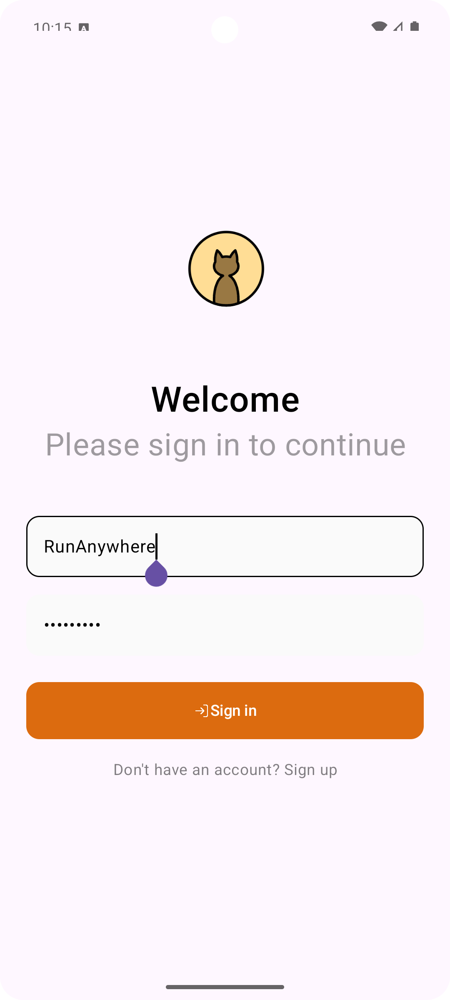
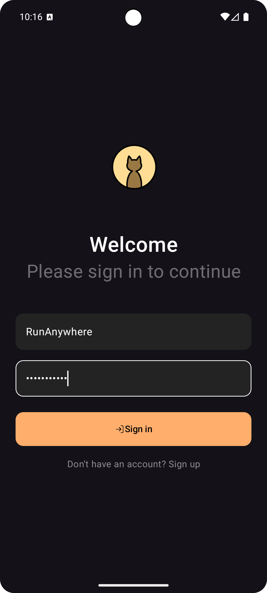
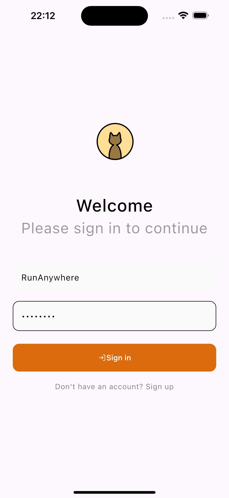
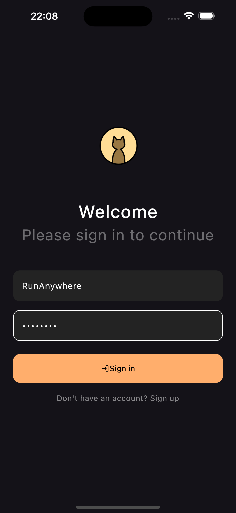
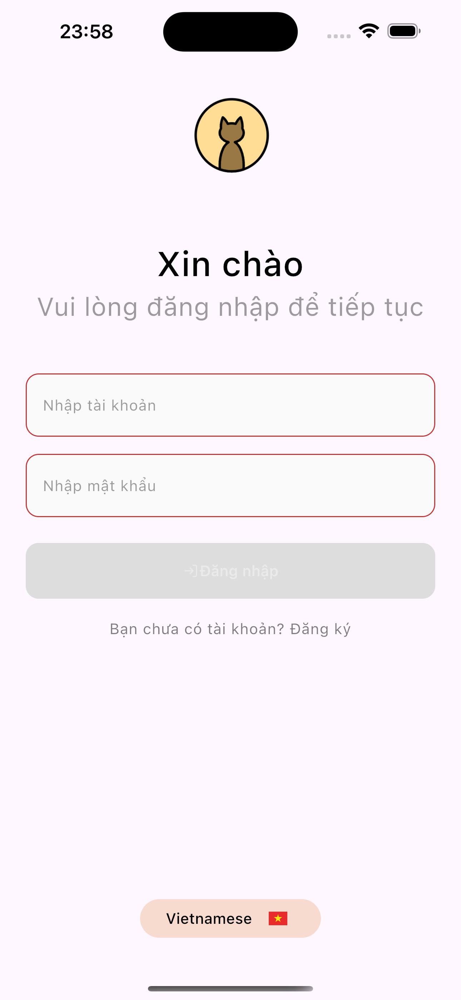

# Kotlin Multiplatform app template

This is a basic Kotlin Multiplatform app template for Android and iOS. It includes shared business logic and data handling, and a shared UI implementation using Compose Multiplatform.

### Technologies

The app uses the following multiplatform dependencies in its implementation:

- [Compose Multiplatform](https://jb.gg/compose) for UI
- [Compose Navigation](https://www.jetbrains.com/help/kotlin-multiplatform-dev/compose-navigation-routing.html)
- [Ktor](https://ktor.io/) for networking
- [kotlinx.serialization](https://github.com/Kotlin/kotlinx.serialization) for JSON handling
- [Coil](https://github.com/coil-kt/coil) for image loading
- [Koin](https://github.com/InsertKoinIO/koin) for dependency injection

> These are just some of the possible libraries to use for these tasks with Kotlin Multiplatform, and their usage here isn't a strong recommendation for these specific libraries over the available alternatives. You can find a wide variety of curated multiplatform libraries in the [kmp-awesome](https://github.com/terrakok/kmp-awesome) repository.

### Login screen

- Demo custom theme -> custom button, custom textfield, custom text
- Light/dark theme
- Multiple languages

- Android

 

- IOS

 
